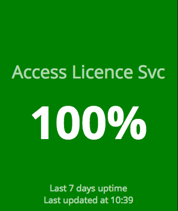
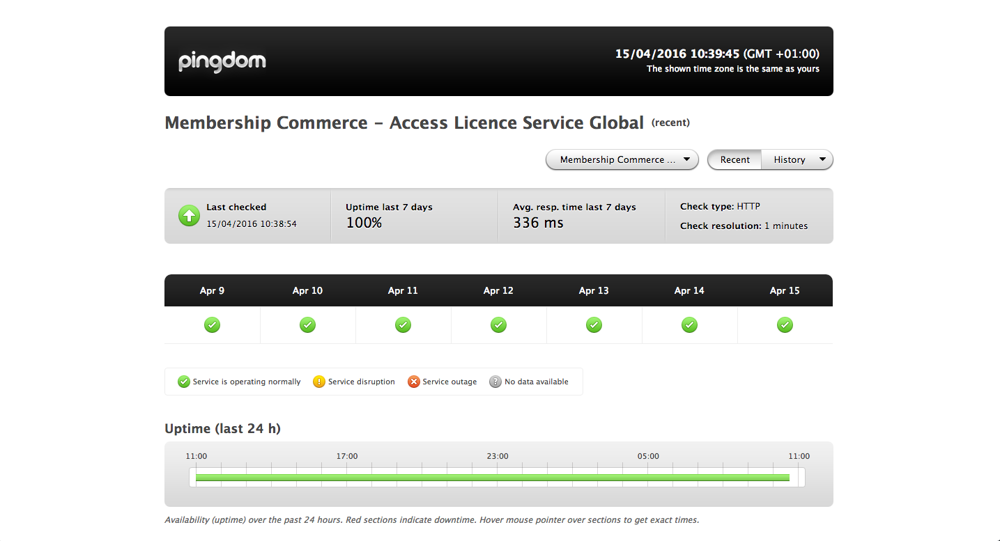

# Membership Platform Dashing

## Introduction

This project is forked from the [core Dashing project](http://shopify.github.com/dashing) started by Shopify. It houses
dashboards in use by the Membership Commerce Team.

## Dashboards

### Availability

[http://memb-status.in.ft.com/availability](http://memb-status.in.ft.com/availability)     

The availability dashboard reports the availability of various business capabilities supported by various platform
services. Example: Ability to log users in, change user credentials, manage content access etc.
 
#### Metrics exposed

##### Current availability

Current availability of a capability is exposed in the form of color of the tile. The status is obtained by polling an
endpoint that exposes results of critical monitoring tests.   

* Green = available
* Red = unavailable
* Grey = status unknown

Clicking on the current status widget takes you to the source of the metric data. Example: https://login-api-at-eu-prod.herokuapp.com/tests/critical

##### Availability trend

A percentage figure for the total availability in the last 7 days is obtained from a pre-configured 
[Pingdom](https://www.pingdom.com/) check and displayed in a tile. 

Clicking on the tile takes you to the detailed availability trend page in Pingdom for a specific monitoring test. 
Example: http://stats.pingdom.com/56q7ie6hfq8y/2014224

## Developer guide

### Tech stack
* [Dashing](https://github.com/Shopify/dashing)
* [Pingdom](https://www.pingdom.com/)
* [Atam4j](https://github.com/atam4j/atam4j)

### Where is the app hosted?

Heroku - [https://dashboard.heroku.com/apps/memb-commerce-dashing/resources](https://dashboard.heroku.com/apps/memb-commerce-dashing/resources)

### Anatomy of the availability dashboard
TODO